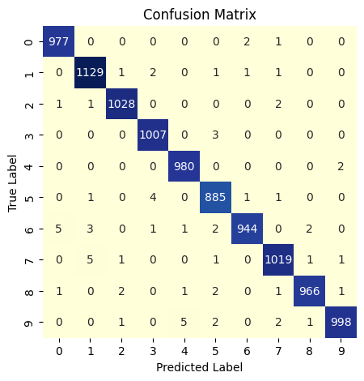
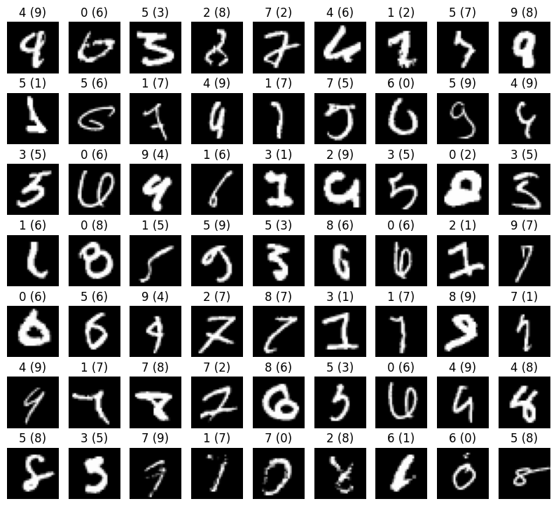

# MNIST Digit Classification with 8k parameters

In this project, I'm going to document my journey of creating a model that can classify the MNIST dataset with the following conditions-
* 5 Epochs
* 8k Parameters
* 99.4 %+ Validation Accuracy

## Why the Hell?
First of all, While doing this challenge I'm Jobless, It was suggested by a senior he emphasized on the fact that It'll be a good learning experience.

One Good Application of this is that we can use this model in a microcontroller for inference. 8k parameters means  memory of 16kB(Float16), For an ESP-MCU this amount of memory is available. So, we can use this model in a microcontroller.

This Problem emelutes the condition perfectely where we have to use a small model with limited resources. Further down the road I may also try reducing the data, as having a good data is not always possible.

I'll be using Pytorch for this project.

## Iteration 1: Simple Fully Connected Network

So, Lets make things clear 8k is not a lot of parameters. So, we need to make sure that we use them wisely. The image size is `28x28` pixels. We can't use a lot of convolutions.
Here are the things I'm going to try-

* 3x3 Convolutions
* 4 Convolutions
* filters = `8, 8, 16, 32`
* 2 max pooling layers
* No Padding
* ReLU Activation

This will give us a total of `7,762` trainable parameters.

## Iteration 2: Adding Batch Normalization & Other Techniques

So far, I've achived a validation accuracy of `98.6`% with the previous model.
There are some techniques that are believed to be objectivly better for training a model and then there are some that have a very good chance of improving the model.

I'll be trying the following techniques-
* **Batch Normalization**
* **Leakly ReLU**
* **Learning Rate Scheduling**

Adding Batch Normalization will increase the number of parameters from `7,762` to `7,890` which is still under 8k.

I'm also going to be improving the overall pipeline and add new features for better logging and visualization.

## Iteration 3: New Architecture
So Far, I've achived a validation accuracy of `99.3`% with the previous model.
Now, I'm going to try and understand why the model is making mistakes by observing the confusion matrix & missclassified images from [Version 2](<Version 2.ipynb>).

<!--  -->
<!-- putting these images side to side using html -->

    
    

Some of the missclassified images are very hard to classify even for humans. But, there are some images that are very easy to classify.

